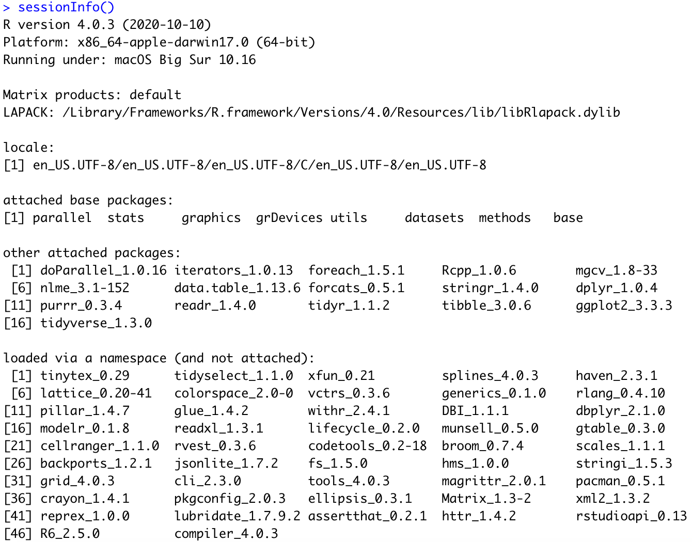

# Evaluating risk detection methods to uncover ontogenic-mediated adverse drug effect mechanisms in children

This repository contains the scripts and data for this study. Run each script at the same level e.g. \*01 before \*02 scripts. `sim_generate_data` would run in about a day or so using 50 cores, `sim_simulate_dynamics` would take about 3 minutes on 1 core only, `sim_performance_results` would take about 30 minutes using 5 cores, and `sim_realworld_validation` would take about 10 minutes using 5 cores. 

The data for the performance/description results are made available in `data/ade_simulation_data`. Running all scripts except `sim_generate_data` should reproduce all manuscript plots (plots may have composed figures - Created with BioRender.com). 

Tested on a 16GB RAM local machine (massively parallel computations were run on a 64-core 128GB RAM machine) and:

